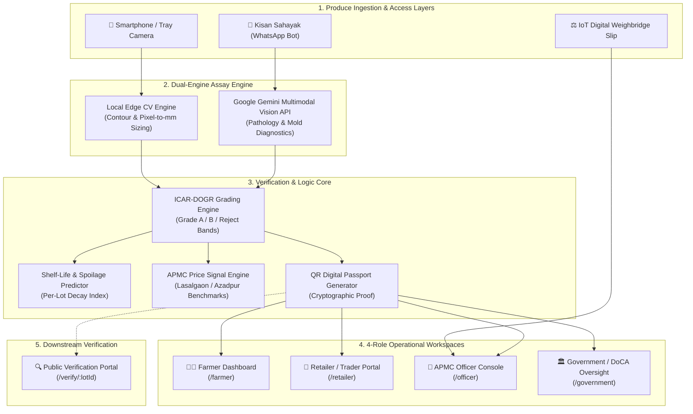

# 🧅 OnionGrade AI: Autonomous Optical Quality Grading for Mandi Transparency & Fair Price Discovery

[](https://www.sih.gov.in/)
[](https://www.sih.gov.in/)
[](https://react.dev/)
[](https://tailwindcss.com/)
[](https://ai.google.dev/)
[](https://dogr.icar.gov.in)
[](https://www.meity.gov.in)

> **Autonomous, dual-engine computer vision platform that eliminates subjective visual grading of onions at APMC Mandis, provides cryptographically verifiable QR digital passports, predicts buffer-stock shelf-life, and bridges the digital divide via multilingual WhatsApp Sahayak.**

---

## 📌 Executive Summary & The Ground Reality

In India, **onions (*Allium cepa*) do not carry a statutory Minimum Support Price (MSP)**. Instead, they fall under the perishables component of the **PM-AASHA** scheme and periodic buffer-stock procurement operations led by **NAFED** and **NCCF** (target: 300,000–500,000 MT annually). 

At the ground level in Asia's largest onion hubs—such as **Lasalgaon and Pimpalgaon APMC Mandis (Nashik, Maharashtra)**—pricing is dictated in seconds by commission agents (*arhtiyas*) through **subjective eyeball grading**. 

```
                                  THE APMC MANDI BOTTLENECK
   [Farmer Brings Produce] ──► [Subjective Eyeball Assessment (5-10s)] ──► [Arbitrary Price Cut (₹200-500/Qtl)]
             ▲                                                                           │
             │                                                                           ▼
   [High Transportation Cost] ◄──────────── [Distress Sale / No Recourse] ◄───────────────┘
```

### Critical Pain Points Addressed:
1. **Unilateral Arbitrary Discounts:** In the absence of calibrated grading instruments, smallholder farmers face arbitrary discounts of ₹200 to ₹500 per quintal under claims of "poor sizing" or "latent rot." Farmers lack timestamped, tamper-proof proof of their produce quality.
2. **Post-Harvest Buffer-Stock Spoilage:** Historically, **25% to 30% of government buffer stocks rot in cold storage** because asymptomatic and early-stage infections (*Aspergillus niger*, soft rot) are co-packed with healthy bulbs.
3. **The Digital Divide:** Over 65% of smallholder farmers do not have the technical literacy to navigate complex enterprise applications or state portals.
4. **Supply Chain Opacity:** Downstream buyers, institutional procurement agencies, and consumers have zero verifiable traceability into the origin or quality grade of the lot once it leaves the mandi yard.

**OnionGrade AI introduces an objective, rapid optical assaying layer *at the point of intake*, producing an immutable digital certificate, predictive shelf-life scoring, and fair price negotiation recommendations.**

---

## ⚡ Core Technical Innovations

### 1. Dual-Engine Computer Vision Pipeline (Edge CV + Multimodal LLM)
* **Layer 1: On-Device Edge Contour Sizing:**
  * Runs client-side dimensional analysis for offline-first resilience.
  * Calculates equatorial bulb diameter ($D_{\text{eq}}$) and pixel-to-millimeter ratio using reference tray calibration.
  * Rapidly classifies lot distributions according to **ICAR-DOGR** (Directorate of Onion and Garlic Research, Pune) size bands:
    * **Grade A:** $>80\text{ mm}$ equatorial diameter.
    * **Grade B:** $50\text{ mm} - 80\text{ mm}$ equatorial diameter.
    * **Grade C / Small:** $30\text{ mm} - 50\text{ mm}$ equatorial diameter.
* **Layer 2: Google Gemini Multimodal Vision Phytopathology Engine:**
  * Ingests high-resolution tray imagery via prompt-engineered structured JSON pipelines.
  * Identifies and quantifies visible pathologies:
    * **Black Mold Rot:** *Aspergillus niger* hyphae and spore accumulation under outer tunics.
    * **Watery Soft Rot:** *Pectobacterium carotovorum* maceration and scale liquefaction.
    * **Apical Sprouting:** Green shoots exceeding $>10\text{ mm}$ (dormancy break indicator).
    * **Double/Split Bulbs & Mechanical Damage:** Scalp lacerations from improper de-topping.

### 2. QR-Code Traceable Digital Quality Certificate (`/verify/:lotId`)
* Every analyzed lot receives an immutable **Digital Quality Passport** encoded in a high-density QR code.
* Downstream retailers, cold storage operators, institutional buyers, and consumers can scan the QR code to view:
  * Official lot ID, APMC mandi source, and timestamp.
  * Verified ICAR grade breakdown ($A\%$, $B\%$, Reject $\%$).
  * High-resolution photographic audit evidence with bounding-box annotations.
  * Spoilage prediction metrics and digital inspector seal.

### 3. "Kisan Sahayak" Multilingual WhatsApp Bot
* Eliminates application installation friction for rural smallholders.
* Full conversational simulator supporting **English, Hindi (हिंदी), Marathi (मराठी), and Gujarati (ગુજરાતી)**.
* **Multimodal Interaction:**
  * Farmers snap a photo and send it to a WhatsApp Business number.
  * Voice synthesis simulation allows farmers to listen to the grading diagnosis and price recommendation in their mother tongue.
  * Generates instant grading receipts directly within the chat.

### 4. APMC Market Price Signal & Fair Price Discovery
* Integrates market intelligence comparing lot grade against live APMC benchmarks (Lasalgaon, Pimpalgaon, Pune, Azadpur Mandi Delhi).
* Computes recommended fair price bands (e.g., Grade A: ₹2,400–₹2,650/qtl vs. Grade B: ₹1,800–₹2,050/qtl).
* Highlights inter-mandi arbitrage opportunities to prevent distress selling at local yards.

### 5. ICAR Spoilage & Shelf-Life Predictor (Buffer-Stock Preservation)
* Computes a **Per-Lot Decay Index (PDI)** based on detected pathogen density, skin retention, and sprout emergence.
* Classifies lots into risk tiers:
  * 🟢 **Low Risk (Shelf-Life: 45–60 Days):** Suitable for long-term NAFED buffer storage.
  * 🟡 **Medium Risk (Shelf-Life: 15–30 Days):** Priority retail distribution.
  * 🔴 **Critical Risk (Shelf-Life: <7 Days):** Immediate local dispatch or dehydration processing.
* **Directly tackles NAFED's historical 25–30% storage loss** by preventing cross-contamination in storage stacks.

---

## 🏛️ System Architecture



---

## 👥 4 Operational Roles (Role-Based Access Control)

The platform implements strict RBAC aligned with the **Digital Personal Data Protection (DPDP) Act, 2023**, tokenizing farmer identities to prevent buyer bias.

| Role | Portal Path | Primary Action | Key Features |
| :--- | :--- | :--- | :--- |
| **👨‍🌾 Farmer / Seller** | `/farmer` | **GRADE & DISPUTE** | Upload tray photo, inspect grading breakdown, access fair price discovery, download QR digital passport, file 1-click disputes. |
| **🏪 Retailer / Trader** | `/retailer` | **ANONYMIZED BROWSE** | Browse APMC lots, view size distributions and quality indices without seeing farmer PII, verify QR passports. |
| **👮 Procurement Officer** | `/officer` | **PROCESS QUEUE** | Manage mandi intake queue, integrate digital weighbridge slips, issue verified assay seals, resolve first-tier grievances. |
| **🏛️ Government / Oversight** | `/government` | **OVERSEE & ARBITRATE** | Real-time APMC quality heatmaps, post-harvest rot tracking, regional price monitoring, statutory dispute arbitration terminal. |

---

## 🧪 Demo Test Credentials

Reviewers and judges can test all four role dashboards using the built-in quick-switch credentials:

| Role | Auth Method | Identifier / Username | Demo Password / OTP |
| :--- | :--- | :--- | :--- |
| **Farmer** | Phone OTP | `+91 98224 81920` | `4280` *(or click Quick Demo)* |
| **Retailer / Trader** | Phone OTP | `+91 94250 11983` | `4280` *(or click Quick Demo)* |
| **Procurement Officer** | APMC ID + Pass | `APMC-INSP-8492` | `password123` |
| **Government / DoCA** | Official ID + Pass | `DOCA-HQ-ND-01` | `govadmin2026` |

---

## 🛡️ Regulatory Compliance & Ground-Truth Standards

### 1. ICAR-DOGR Size Bands
Our classification thresholds align with the research guidelines formulated by the **Directorate of Onion and Garlic Research (DOGR, Pune)**:
* **Grade A (Premium):** $>80\text{ mm}$ diameter. Zero visible mold, dry intact tunic ($>90\%$), $<5\%$ surface defects.
* **Grade B (Standard):** $50\text{ mm} - 80\text{ mm}$ diameter. Minor outer skin peeling permitted, no active soft rot.
* **Grade C / Reject:** $<50\text{ mm}$ or bulbs exhibiting active *Aspergillus niger* mold, wet rot, or $>10\text{ mm}$ sprouts.

### 2. Digital Personal Data Protection (DPDP) Act, 2023 Compliance
* **Farmer PII Tokenization:** Traders browsing lots view only anonymized identifiers (e.g., `LOT-MH-2026-9481`) and aggregate quality parameters.
* **Consent Architecture:** Farmer contact details are never exposed to downstream buyers without explicit authorization.
* **Append-Only Audit Logs:** AI inference outputs, timestamps, and model hashes are committed to immutable logs to guarantee legal defensibility during disputes.

---

## 💻 Tech Stack & Engineering Highlights

```
Frontend:           React 19, Tailwind CSS v4, Framer Motion, GSAP, Lucide React
Routing & State:    React Router v7, React Context (AuthContext, LanguageContext)
Computer Vision:    Google Gemini 1.5/2.5 Multimodal Vision API + Edge Canvas CV
QR Code Engine:     qrcode (ISO/IEC 18004 compliant SVG & Canvas generator)
Serverless Proxy:   Node.js / Vercel Serverless Function (api/gemini.js)
Code Hygiene:       Oxlint, Vite 8 Fast HMR, Strict Git Ignore Config
```

---

## 🚀 Quickstart & Local Installation

### Prerequisites
* **Node.js:** v18.0.0 or higher
* **npm:** v9.0.0 or higher
* **Google Gemini API Key:** (Optional for live inference; robust mock fallbacks are included)

### 1. Clone the Repository
```bash
git clone https://github.com/dwij-25/oniongrade-ai.git
cd oniongrade-ai
```

### 2. Install Dependencies
```bash
npm install
```

### 3. Environment Configuration
Create a `.env.local` file in the project root:
```env
# Optional: Provide Gemini API Key for real-time live vision inference
VITE_GEMINI_API_KEY=your_gemini_api_key_here
```
*(Note: If no API key is provided, the application automatically engages high-fidelity simulated vision inference calibrated against realistic onion tray samples).*

### 4. Run Development Server
```bash
npm run dev
```
Open your browser at `http://localhost:5173`.

### 5. Build for Production
```bash
npm run build
npm run preview
```

---

## 📂 Project Directory Structure

```
oniongrade-ai/
├── api/
│   └── gemini.js                 # Vercel serverless proxy protecting API credentials
├── docs/
│   └── presentation/             # SIH PPTX decks, academic posters, and Python build scripts
├── public/                       # Static assets and PWA icons
├── src/
│   ├── components/
│   │   ├── DisputeModal.jsx      # Grievance filing & arbitration state machine
│   │   ├── GradingModal.jsx      # Universal modal launcher for optical grading
│   │   ├── GradingWorkflow.jsx   # Live camera capture, edge sizing & visual diagnosis
│   │   ├── Header.jsx            # Dynamic role-aware navigation header
│   │   ├── LoginModal.jsx        # RBAC login modal with test credential shortcuts
│   │   ├── ProcurementModal.jsx  # Digital weighbridge intake slip generator
│   │   ├── QrLotPassportModal.jsx# Tamper-evident QR certificate modal
│   │   └── WhatsAppSahayakModal.jsx # Multilingual WhatsApp bot simulator with voice notes
│   ├── context/
│   │   ├── AuthContext.jsx       # Multi-role authentication & session state
│   │   └── LanguageContext.jsx   # Multilingual localization provider (EN, HI, MR, GU)
│   ├── constants/
│   │   ├── rules.js              # ICAR-DOGR grading bands & RBAC roles
│   │   └── translations.js       # Multilingual dictionaries
│   ├── pages/
│   │   ├── PublicLanding.jsx     # Hero landing page, architecture showcase, APMC price tickers
│   │   ├── LoginPage.jsx         # Standalone RBAC authentication portal
│   │   ├── FarmerDashboard.jsx   # Farmer lot management, price signals, dispute tracker
│   │   ├── RetailerDashboard.jsx # Anonymized marketplace browser & quality search
│   │   ├── OfficerDashboard.jsx  # Mandi intake queue & weighbridge manager
│   │   ├── GovernmentDashboard.jsx # National analytics, heatmaps & dispute magistrate
│   │   └── LotVerificationPage.jsx # Public QR certificate verification portal (/verify/:lotId)
│   ├── services/
│   │   ├── geminiVision.js       # Multimodal AI prompt engineering & inference handler
│   │   └── storage.js            # Offline-first persistence & simulated APMC database
│   ├── App.jsx                   # Master routing & layout container
│   ├── main.jsx                  # React DOM entry point
│   └── index.css                 # Tailwind CSS v4 styling rules
├── .env.example                  # Environment configuration template
├── .gitignore                    # Enterprise gitignore filtering secrets and large binaries
├── package.json                  # Project manifest, dependencies, and metadata
└── README.md                     # International competition documentation
```

---

## 🔮 Future Roadmap (Beyond SIH)

1. **Hardware Add-On: Low-Cost Multispectral Clip-On:**
   * Developing a ₹500–₹1,500 optical clip-on lens utilizing near-infrared (NIR: 750–950nm) narrow-bandpass filters to detect internal basal rot and water-core before surface symptoms emerge.
2. **e-NAM Native Integration:**
   * Packaging OnionGrade AI as an automated assaying microservice that pushes digital grade certificates directly into the National Agriculture Market (e-NAM) lot registry.
3. **Automated Conveyor Ingestion:**
   * Transitioning from static tray captures to high-speed line-scan camera setups for automated sorting chutes at APMC mandi intake gates.

---

## 👥 Authors & Acknowledgments

* **Dwij Pancholi** ([@dwij-25](https://github.com/dwij-25) | [dwijpancholi@gmail.com](mailto:dwijpancholi@gmail.com)) — *Lead Architecture & Full-Stack / AI Vision Engineering*
* Built for **Smart India Hackathon (SIH) 2026** under the **Agriculture, FoodTech & Rural Development** theme.

### Key References & Standards
1. **ICAR – Directorate of Onion and Garlic Research (DOGR)**, *Onion Quality Grading Guidelines*, Pune.
2. **Ministry of Agriculture & Farmers Welfare**, *Agricultural Produce (Grading and Marking) Act, 1937*.
3. **Ministry of Electronics and Information Technology (MeitY)**, *Digital Personal Data Protection Act, 2023*.
4. **Directorate of Marketing & Inspection (DMI)**, *Fruits and Vegetables Grading and Marking Rules, 2004*.
5. **NAFED & NCCF**, *Price Stabilization Fund (PSF) Onion Buffer Stock Management Manual*.

---

<p align="center">
  <b>Made with ❤️ for Indian Farmers & Transparent Mandi Trade 🇮🇳</b>
</p>
